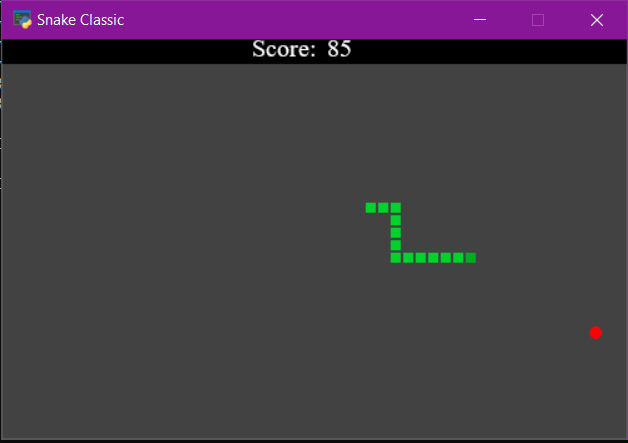
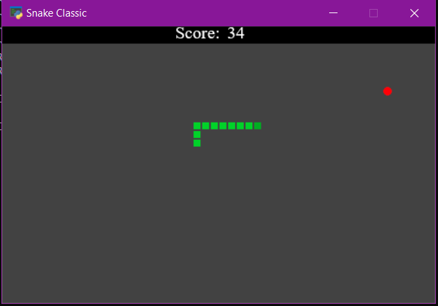

# snake
Snake - Pyglet

Dependencies:
* Pyglet
* Random

install dependencies:

    pip install pyglet
    pip install random
 
Controls: Use arrow keys to move the snake.

Speed: Alter the SPEED variable in the script to speed up or slow down the game.
